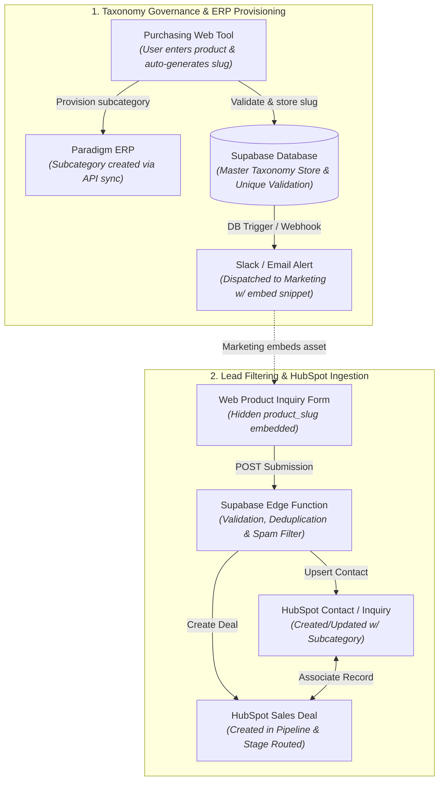

# Product Taxonomy Governance, Supabase Ingestion, & HubSpot Deal Creation

| Metric / Attribute | Details |
| :--- | :--- |
| **Project Sponsors** | Operations, Marketing & RevOps Leadership |
| **Key Stakeholders** | Purchasing / Procurement, Marketing, Full-Stack / Backend Engineering, CRM / SalesOps Admin |
| **Core Stack** | Purchasing Web Tool, Supabase (PostgreSQL + Edge Functions), Paradigm ERP, HubSpot CRM |

---

## 1. Executive Summary

This project centralizes product taxonomy governance, automated ERP provisioning, and web inquiry filtering into a unified Supabase backend architecture that directly drives automated Inquiry logging and Deal creation in HubSpot.

* **Taxonomy Governance & ERP Sync**: When Purchasing enters a new product line into the Purchasing Web Tool, the system validates a unique URL slug, stores it as the subcategory in Supabase, and automatically provisions the subcategory in Paradigm ERP. Marketing is immediately alerted with deployment assets (URLs, tracking parameters, hidden form fields).
* **Inquiry Ingestion & Lead Routing**: When a prospective buyer submits an inquiry form on the website, the submission is ingested and filtered by Supabase Edge Functions (migrated from the legacy filter API). Once validated against the Supabase taxonomy, the engine automatically creates and associates both the Contact/Inquiry and the corresponding Sales Deal in HubSpot, tagged with the verified product subcategory for pipeline routing.

---

## 2. End-to-End System Architecture & Ingestion Flow

---

## 3. Step-by-Step Data Lifecycle

### Phase 1: Taxonomy Governance & Provisioning
1. **Entry & Slug Generation**: Purchasing staff creates a product subcategory in the Purchasing Web Tool. The tool generates a standardized, URL-safe slug (e.g., `standing-seam-24ga`).
2. **Taxonomy Validation & Storage**: Supabase validates uniqueness across existing categories/subcategories and commits the new record.
3. **ERP Synchronization**: An edge trigger communicates with the Paradigm ERP API to provision the matching subcategory record and stores the ERP reference ID in Supabase.
4. **Marketing Dispatch**: Supabase dispatches a notification payload to Marketing containing:
   * Canonical Product Slug
   * Landing Page URL snippet
   * Form embed hidden field snippet (`<input type="hidden" name="product_slug" value="..." />`)

### Phase 2: Web Inquiry Ingestion & CRM Routing
1. **Form Submission**: Prospective buyer submits an inquiry on the website with lead details and the embedded `product_slug`.
2. **Edge Function Filtering**:
   * **Validation**: Verifies `product_slug` against the Supabase master taxonomy table.
   * **Spam & Deduplication**: Runs honeypot validation, rate limiting, and checks for recent duplicate submissions.
3. **HubSpot Contact Upsert**: Locates existing Contact by email address; creates a new Contact or updates the existing record with latest attribution properties and verified subcategory.
4. **HubSpot Deal Creation & Association**:
   * Generates a new Deal in HubSpot under the designated Sales Pipeline.
   * Dynamically routes Deal stage and assignment rules based on the product subcategory.
   * Establishes a bidirectional record association between Contact and Deal.
