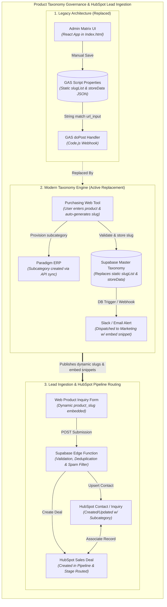

# Product Taxonomy Governance, Supabase Ingestion, & HubSpot Deal Creation

| Metric / Attribute | Details |
| :--- | :--- |
| **Project Sponsors** | Operations, Marketing & RevOps Leadership |
| **Key Stakeholders** | Purchasing / Procurement, Marketing, Full-Stack / Backend Engineering, CRM / SalesOps Admin |
| **Core Stack** | Purchasing Web Tool, Supabase (PostgreSQL + Edge Functions), Paradigm ERP, HubSpot CRM, Google Apps Script (Legacy) |
| **Apps Script Project ID** | `13TXY7olFTZNnyZR3sMUbA2hwfCOxa0-hEuJ_PNxxvD6XlbdQnEckSuyf` |

---

## 1. Executive Summary

This project transitions Best Buy Metals from a manual, static product slug maintenance process into an automated, centralized product taxonomy governance and inquiry ingestion backend.

* **Legacy Architecture (Google Apps Script)**: Previously, product slugs and store availability matrices were maintained manually via a React web app (`Index.html`) stored as a static JSON blob in Google Apps Script `PropertiesService` (`STORE_MATRIX_CONFIG` & `slugList`). The `doPost` webhook in `Code.js` parsed form URLs against this static array, queried an external Zip routing API, and created HubSpot Contacts, Deals, and Custom Inquiries (`2-59384707`).
* **Modern Architecture (Supabase & ERP Integration)**: Replaces the static `slugList` with a unified **Supabase PostgreSQL Master Taxonomy** directly governed by the Purchasing Web Tool. When Purchasing introduces a new product line, the system validates the slug, syncs the subcategory with Paradigm ERP, and alerts Marketing with pre-built tracking and form embed assets. Web form inquiries are ingested via high-throughput Supabase Edge Functions that validate slugs dynamically against the master database and orchestrate HubSpot pipeline routing.

---

## 2. End-to-End System Architecture & Migration Map



---

## 3. Step-by-Step Data Lifecycle

### Phase 1: Taxonomy Governance & Provisioning *(Replaces Static `slugList`)*
1. **Entry & Slug Generation**: Purchasing staff enters a product subcategory into the Purchasing Web Tool. The system generates a sanitized, URL-safe canonical slug (e.g., `standing-seam-24ga`).
2. **Dynamic Validation & Storage**: Supabase validates slug uniqueness against the PostgreSQL taxonomy table, removing the need for manual maintenance in the Apps Script React UI.
3. **ERP Synchronization**: A database trigger / edge worker invokes the Paradigm ERP API to provision the matching subcategory and saves the ERP reference ID to Supabase.
4. **Marketing Dispatch**: Supabase dispatches deployment payloads to Marketing containing canonical slugs, landing page URL parameters, and hidden form embed snippets (`<input type="hidden" name="product_slug" value="..." />`).

### Phase 2: Web Inquiry Ingestion & CRM Routing *(Replaces GAS `doPost`)*
1. **Form Submission**: Prospective buyers submit an inquiry containing contact info, zip code, and the hidden `product_slug`.
2. **Edge Function Filtering**:
   * **Taxonomy Validation**: Validates `product_slug` directly against Supabase rather than a static JSON array.
   * **Location & Drive-Time Routing**: Computes store proximity (Cleveland, Chattanooga, Dalton, Asheville, Greenville, Charlotte, Knoxville, or National fallback).
   * **Spam & Deduplication**: Performs honeypot validation and 24-hour recent deal throttling.
3. **HubSpot Contact & Inquiry Upsert**: Upserts the Contact record and creates the Custom Inquiry Object (`2-59384707`) with the verified subcategory and store assignment.
4. **Deal Creation & Record Association**: Creates the Sales Deal under the appropriate store pipeline (`PIPELINE_MAP`), links attachments as Notes, and associates Contact $\leftrightarrow$ Deal $\leftrightarrow$ Inquiry.

---

## 4. Repository Structure

```
├── .clasp.json             # Google Apps Script Clasp configuration (Script ID linked)
├── .gitignore              # Git ignore rules for node_modules and credentials
├── README.md               # Architecture documentation & system mapping
└── src/
    ├── appsscript.json     # Apps Script manifest and OAuth scopes
    ├── Code.js             # Legacy Apps Script backend (doPost webhook, HubSpot API, routing)
    └── Index.html          # Legacy React UI for manual Store Matrix / slugList configuration
```
